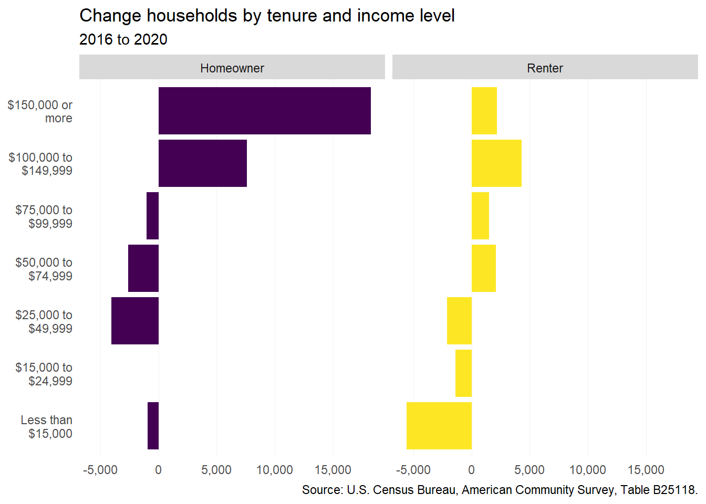
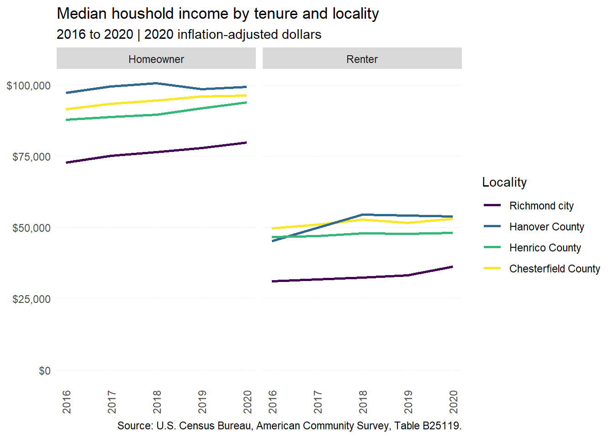
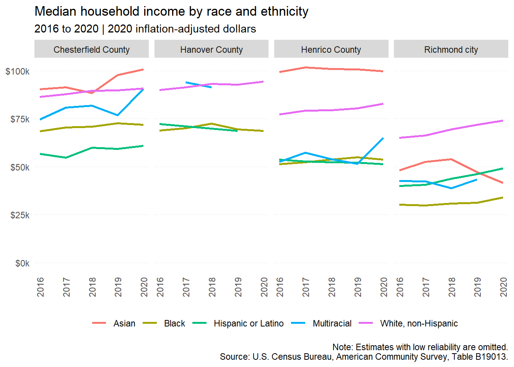
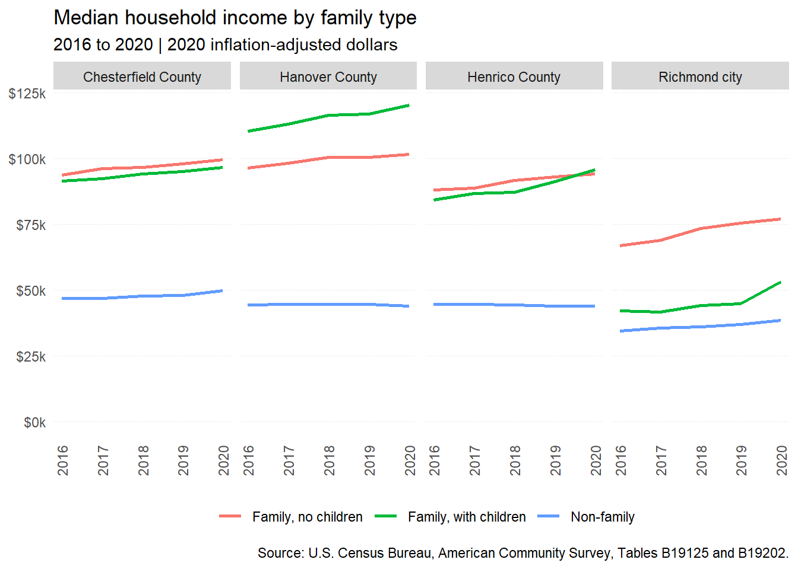
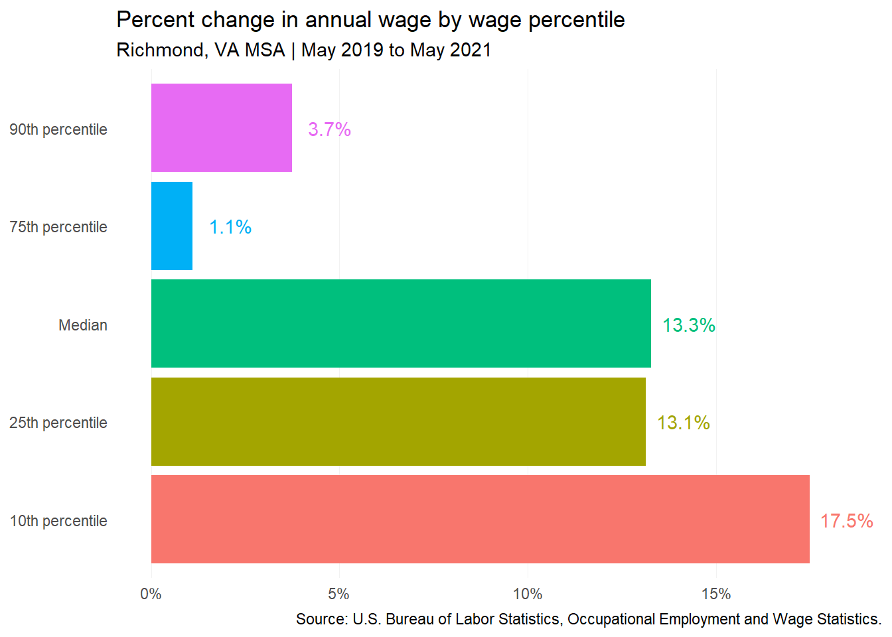

# Incomes and wages {#part-1-3}

## Household incomes

### Incomes by tenure

From 2016 to 2020, the region saw large increases in the number of six-figure income households, particularly among homeowners (well over 25,000), but also renters (almost 6,500). This growth can likely be attributed to both new high-income residents from outside the region, as well as income growth among households already in the region.

There was also a minor increase in the number of middle-income renters earning between \$50,000 and \$100,000, reflecting continued demand for new market-rate apartments---along with affordable starter homes.

(\#fig:hh-inc-plot)Change households by tenure and income level

Average homeowner incomes continue to be well above average renter incomes across the region. When adjusted for inflation, incomes across tenures for each locality show very minor to modest growth. Incomes in the city---for both homeowners and renters---remain significantly below those in the surrounding counties. The average household income for homeowners in the counties is around three times that of renters in Richmond.

(\#fig:med-income-plot)Median houshold income by tenure and locality

### Incomes by race and ethnicity

Average incomes in the region remain unequal by race and ethnicity. Households with the highest incomes include Asian and white, non-Hispanic residents in the counties---earning well above \$75,000. Black and Hispanic households consistently have the lowest average incomes, along with multiracial households in Henrico and Richmond.

(\#fig:inc-race-plot)Median household income by race and ethnicity

### Incomes by family type

Household incomes also vary by the presence of children or other related individuals. Throughout the region, non-family households (i.e., persons living alone or with unrelated persons) consistently have average incomes below \$50,000. In Henrico and Chesterfield counties, families living with and without children under 18 have very similar income levels. This trend is different in Hanover, where families with children have much higher incomes, as well as Richmond, where they have much lower incomes.

(\#fig:inc-child-plot)Median household income by family type

## Wages

:::{.rmdnote}
Wage data in this section is sourced from the Occupational Employment and Wage Statistics (OEWS) program of the Bureau of Labor Statistics. OEWS is updated annually, most recently for 2021 data. This dataset provides a rich look into wage distribution by industry and occupation. 

However, OEWS is only available at the national, state, and metro levels. Therefore, the data below covers the full Richmond, Virginia Metropolitan Statistical Area (MSA) rather than the (smaller) PHA region.
:::

### Wage change by percentile

While regional wages increased across the board from May 2019 to May 2021, the largest percent increases in average wages were among jobs that paid at and below the median wage. In fact, the largest growth occurred in the lowest 10th percentile of wages, due in large part to state lawmakers adopting incremental increases to Virginia's minimum wage in 2020. The first increase from \$7.25 to \$9.50 per hour took effect in 2021.

:::{.rmdnote}
Today, state minimum wage is \$11.00 per hour. Under [current law](https://lis.virginia.gov/cgi-bin/legp604.exe?201+sum+SB7), it will increase again to \$12.00 in 2023. Lawmakers must reenact the measure by July 2024 to initiative further increases to \$15.00 per hour by 2026.
:::

Another factor in this low-end wage growth is likely the [increased pay](https://www.bls.gov/opub/ted/2022/24-percent-of-establishments-increased-pay-or-paid-bonuses-because-of-covid-19-pandemic.htm) offered by many businesses, especially in the food, retail, and accommodation sectors, to encourage workers to return during the COVID-19 recovery.

(\#fig:wage-pct-plot)Percent change in annual wage in Richmond, VA MSA

### Wage change by occupation

Over this same period, wages in the region grew for four of the five most common occupation categories by total employment numbers. Workers in the Transportation and Material Moving sector saw the largest increases---from an average annual salary of \$30,250 to \$36,370 (over 20 percent).

Jobs in Food Preparation and Serving, Sales, and Business and Financial Operations sectors---totaling more than 162,000 workers in the region as of May 2021---also saw wage growth, but less than the 13.3 percent average increase. Meanwhile, wages among Office and Administrative Support positions remained nearly the same (-0.2 percent) from 2019 to 2021.

(\#fig:wage-occ-plot)Percent change in annual wage for top 5 most common occupation categories

