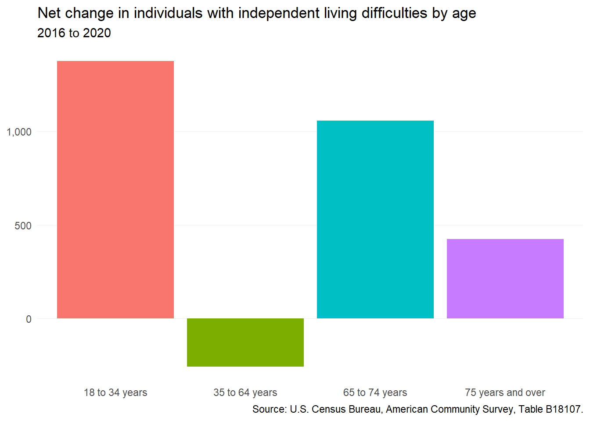
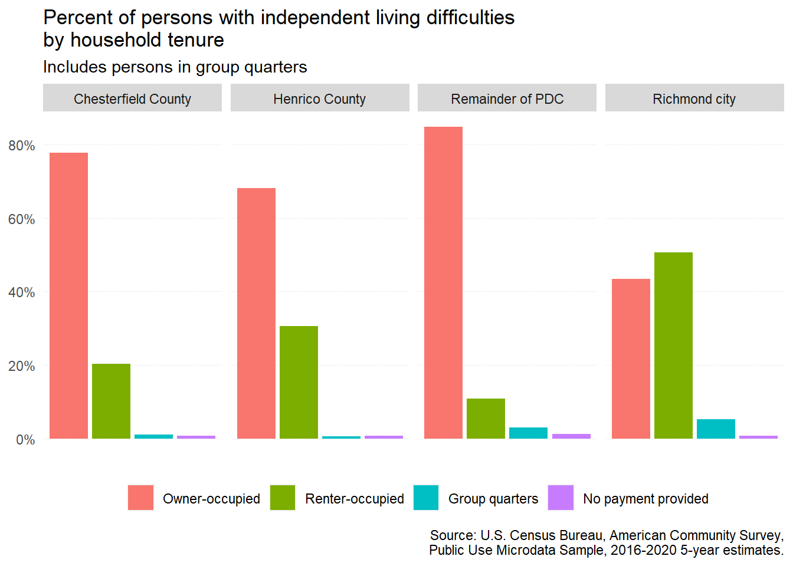
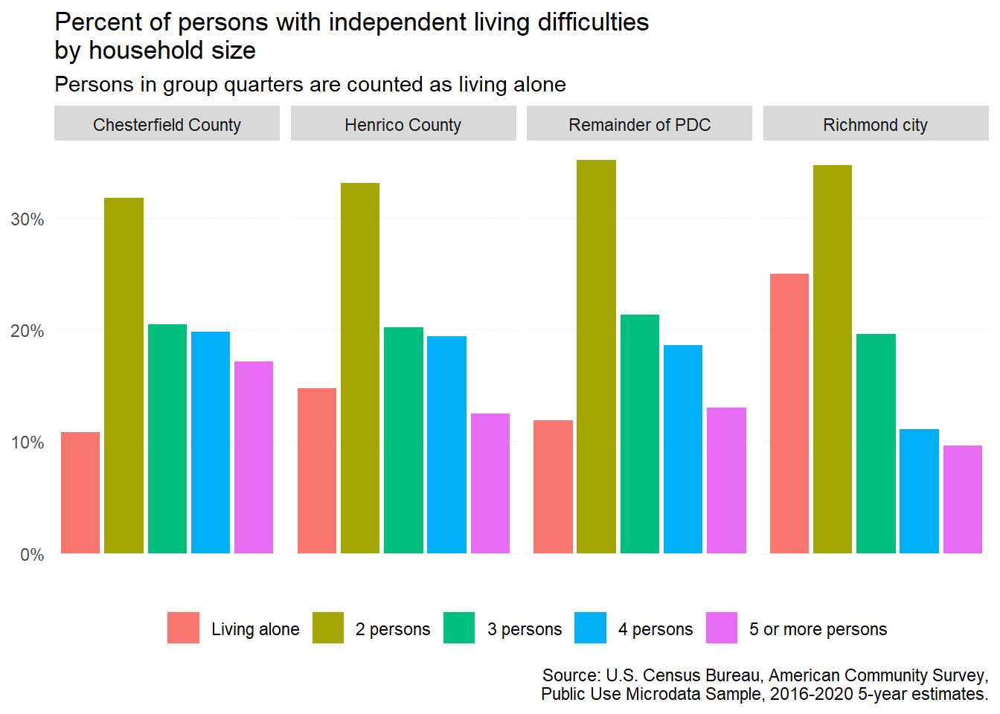
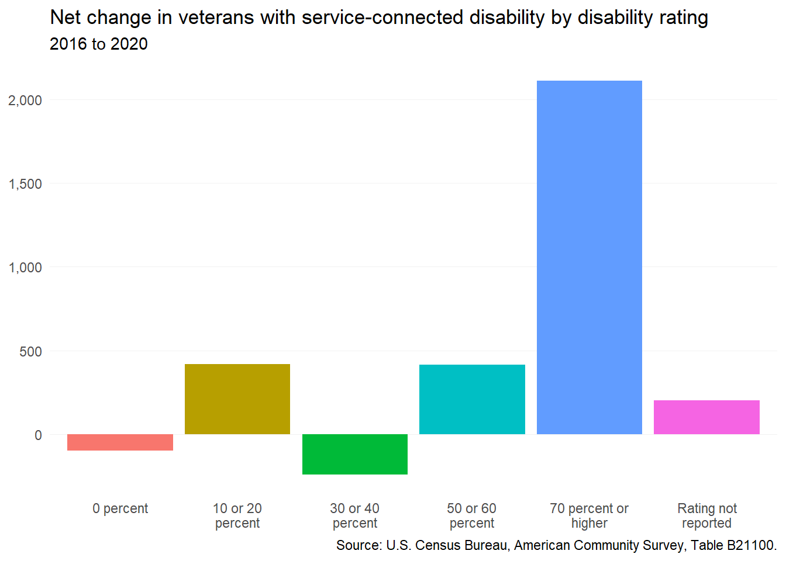

# Special populations {#part-1-4}


## Independent living difficulty

In the American Community Survey (ACS), the Census Bureau collects a range of characteristics to capture the range of different disability types found in the population. One important disability type available in ACS data is *independent living difficulty*, which includes persons who:

> *Because of a physical, mental, or emotional problem, [have] difficulty doing errands alone such as visiting a doctor’s office or shopping.*

As a result, persons with these difficulties often face significant housing challenges as well.

### By age

From 2016 to 2020, the region added almost 2,600 more persons with independent living difficulties. The largest increases occurred among young adults under 35, as well as "young" seniors between 65 and 74. The latter group will see their needs increase acutely in the next decade as they continue to age and potentially become more dependent on others.


<div class="figure">

<p class="caption">(\#fig:ind-liv-age-plot)Net change in individuals with independent living difficulties by age</p>
</div>

### By tenure

:::{.rmdnote}
The detailed estimates for persons with independent living difficulties in this and the next section are not available from the standard ACS tables published by the Census Bureau. The data in these sections come from the Public Use Microdata Sample (PUMS), which are available only by special Public Use Microdata Areas (PUMAs) which contain at least 100,000 people.

While PUMA boundaries align with Chesterfield County, Henrico County, and Richmond city, the PUMA containing Hanover County also includes Powhatan, Goochland, New Kent, King William, Charles City counties.
:::

Nearly all persons with independent living difficulties throughout the region live in regular homes, and not assisted living facilities or other group quarters. Most are in homes that they own, or in homes owned by another occupant, such as a spouse. This is not the case in Richmond, however, where about half live in rented homes.


<div class="figure">

<p class="caption">(\#fig:ind-liv-tenure-plot)Percent of persons with independent living difficulties by household tenure</p>
</div>

### By household size

Persons with independent living difficulties are most likely to live with one other person in their home. Slightly larger households (3 to 4 persons total) are also common. Still, more than 15 percent live alone---including nearly one-in-four in Richmond. However, based on ACS data collection methods, "living alone" also includes persons residing in group quarters.


```
#> # A tibble: 5 × 3
#>   NP                   est   pct
#>   <fct>              <dbl> <dbl>
#> 1 2 persons         288739 0.334
#> 2 3 persons         176111 0.204
#> 3 4 persons         152239 0.176
#> 4 5 or more persons 116202 0.134
#> 5 Living alone      131011 0.152
```

<div class="figure">

<p class="caption">(\#fig:ind-liv-size-plot)Percent of persons with independent living difficulties by household size</p>
</div>

## Veterans with disabilities

Veterans of military service have access to a range of Department of Veterans Administration (VA) benefits, including VA home loans. These benefits also include disability payments for veterans with service-connected disabilities.

To award disability benefits, the VA assigns each disabled veteran a [rating](https://www.va.gov/disability/about-disability-ratings/) from zero to 100 percent based on the severity of their disability or disabilities. A higher rating reflects more significant impairments, and accordingly, additional paid benefits to cover lost wages and extra healthcare services.

From 2016 to 2020, the number of veterans in the region with a service-connected disability increased by more than 2,800. A significant majority of this growth occurred among veterans with disability rating of 70 percent or higher, or those with the most severe physical and/or mental health challenges.

Despite the increased benefits level associated with the higher rating, these disabled veterans may be challenged to find accessible and affordable housing options without additional support.


<div class="figure">

<p class="caption">(\#fig:vets-plot)Net change in veterans with service-connected disability by disability rating</p>
</div>
