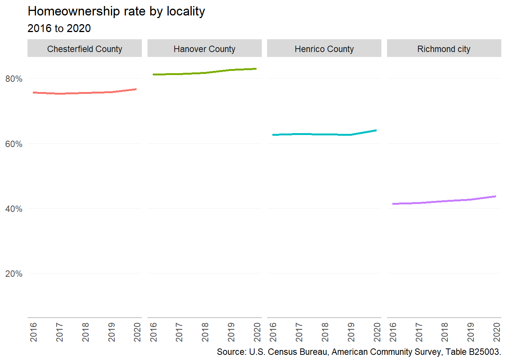
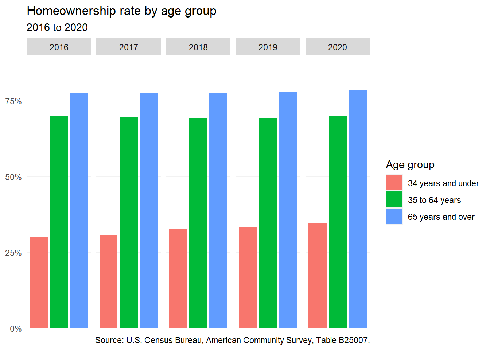
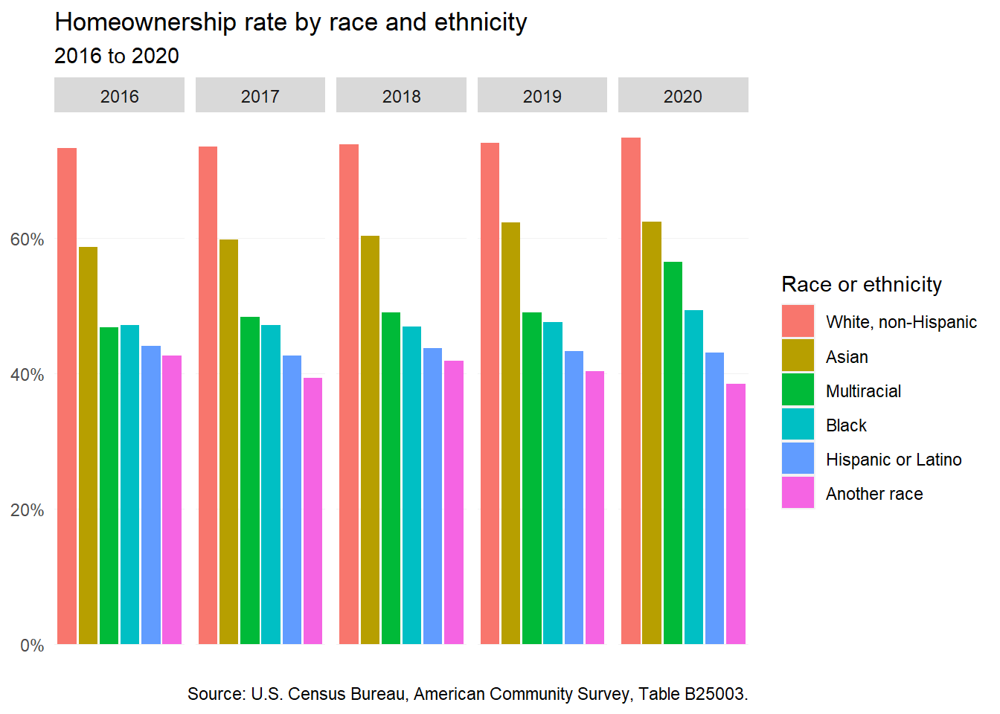
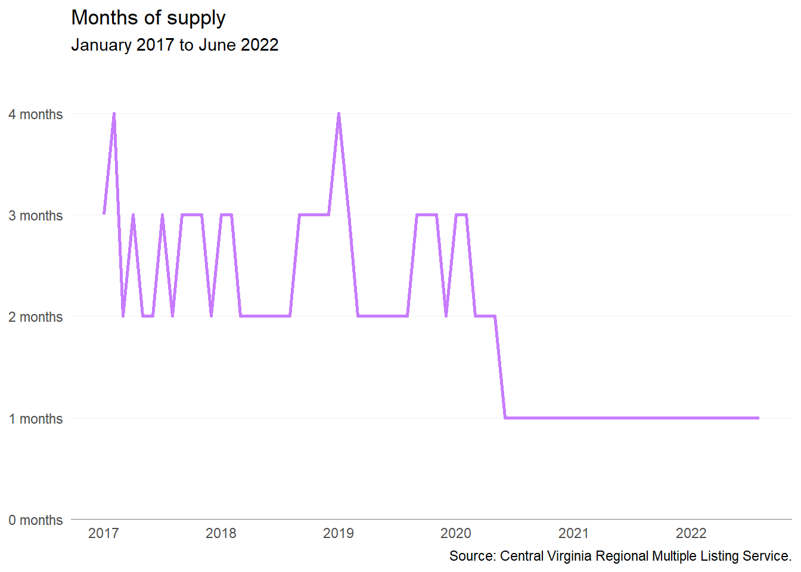
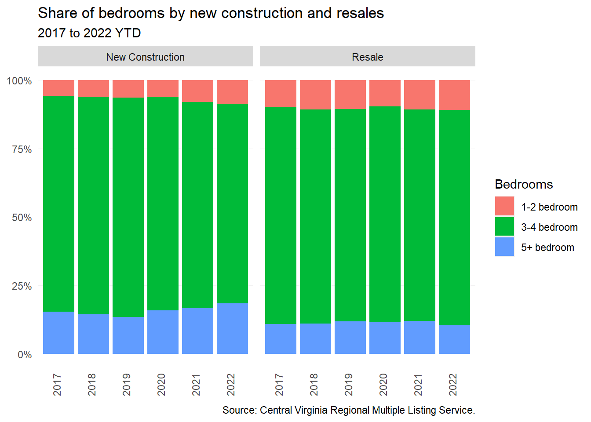

# (PART) PART 2: Housing supply and market changes {.unnumbered}

# Homeownership {#part-2-1}

## Supply

### Change in stock

The stock of homeowner housing has been growing across the region. From 2016 to 2020, owner-occupied housing has increased by 17,436---an increase of seven percent. Unsurprisingly, much of that growth (93 percent) has occurred in the single-family home market, including detached and attached homes. The largest share of that single-family home growth has occurred in Chesterfield County, where there was a net gain of 7,184 single-family owner-occupied homes.

(\#fig:oo-structure-plot)Change in owner-occupied housing units by structure type

### Age of stock

Between 2016 and 2020, almost all additions to the homeowner-occupied housing stock in the region were, intuitively, homes built in the past decade. However, there have also been thousands of net additions among homes built before 1940 and between 1980 and 2009. These homes were most likely previously occupied by renters and have now been reconverted into homeownership opportunities.

(\#fig:oo-age-plot)Change in owner-occupied housing units by year built

### Bedrooms

The majority of new owner-occupied homes in the region have three or more bedrooms, continuing design and size trends prevalent since the mid 20th century. At the same time, homeowner households have become smaller, which creates a surplus of largely unused bedrooms across the market.

Smaller housing options exist largely in the City of Richmond or Henrico County. While single-family homes---or condo units---with one- or two- bedrooms are usually much more affordable, these housing options are often in older, but highly desirable neighborhoods in the City of Richmond (i.e., The Fan and Church Hill).

(\#fig:oo-beds-plot)Change in owner-occupied housing units by number of bedrooms

### Production

All localities in the region experienced single-family construction declines as a result of the Great Recession from late 2007 to early 2012 --- especially Chesterfield and Henrico. Recovery has been unevenly distributed, however.

From 2010 onward, every locality has seen increasing single-family home construction, but the steepest increase has been in Chesterfield County. From 2010 to 2020, single-family home construction has gone from 545 units to 2,202 per year in a decade --- a 300% increase. Although Chesterfield County was on its way to pre-Recession levels, all other localities are seeing slow growth in the single-family home construction space.

(\#fig:bps-plot)Single-family building permits

## Homeownership rate

### By locality

Since 2016, overall homeownership rates for localities in the region have increased slightly. This accounts for the net increase in homeowners (over 15,000) and relatively steady number of renters over this time period.

(\#fig:ho-rate-plot)Homeownership rate by locality

### By age

Despite high rents, high debt, and low inventory, younger households (under 35) have made some progress toward homeownership since 2016. Their homeownership rate across the region increased from 30 to 35 percent. On the other hand, homeownership rates for middle-age and older households remained about the same from 2016 to 2020.

(\#fig:ho-age-plot)Homeownership rate by age group

### By race and ethnicity

Across the region, the homeownership gap remains wide between white households and households of color. White households in the Richmond area are the only group with a homeownership rate above 70 percent. However, several other groups---including Asian, multiracial, and Black households---have seen slight increases in their homeownership rates since 2016. At the same time, homeownership rates have fallen slightly for Hispanic or Latino households and those of another race.

(\#fig:ho-race-plot)Homeownership rate by race and ethnicity

## For-sale market

### Closed sales

Home sales in the region continued to follow seasonal patterns during the COVID-19 pandemic. All localities saw reductions in typical sales volumes during early parts of the pandemic (spring to early summer 2020)---no doubt a result of stay-at-home orders. But by 2021, sales volume began to climb back as historically low interest rates incentivized home buying. 

(\#fig:sales-plot)Monthly home sales by locality

Chesterfield County continued to lead the region in home sales---hitting a monthly peak in June 2021, with a total of 809 sales. In nearly all localities except for Chesterfield County, the average monthly home sales has largely remained the same. Only in Chesterfield County was there a more than 10 percent increase in average monthly home sales between 2019 and 2021.

(\#fig:sales-avg-plot)Average monthly home sales by locality

### Sales price

Median home prices have continued to climb in the Richmond Region---reaching over \$300,000 in all four major localities. The greatest price increases have occurred in the City of Richmond during 2022, where the median home price went from \$292,000 in February to \$389,950 in June, a 33 percent increase. Home prices are continuing to trend upward in spite of rising mortgage interest rates. 

Hanover County remains the most expensive locality in the region with a median home price of \$431,020 in June 2020, followed by the City of Richmond (\$389,950), Chesterfield County (\$380,000), and Henrico County (\$350,000).

(\#fig:sales-price-plot)Monthly median sales price by locality

### Supply

The inventory of for-sale housing before the pandemic typically sat at two months or more---meaning that it would take two or more months to sell at current prices. A healthy level of supply has said to be five or six months worth, but in recent years the region has been below that, which indicates a strong seller's market. 

When pandemic began in March 2020, months supply dropped to two months and then by June 2020 hit a low of one month and has sat squarely there ever since. Even amid rising interest rates in 2022 and talks of a housing recession, months supply continues to remain low.

(\#fig:supply-plot)Months of supply

### Starter homes

Starter homes provide young adults the ability to get on the first rung of the homeownership ladder. This allows many young adults the ability to build equity before their household grows (i.e. marriage and children). But starter homes are becoming more and more scarce. This has largely because those starter home opportunities are not coming to market. In some cases, older homes occupied by seniors are not hitting the market because senior desire to age-in-place remains high or seniors simply cannot find other affordable options themselves. Starter homes are also ripe for investor flipping, which leaves first-time homebuyers competing with all cash offers. 

In addition, smaller homes do not make up a significant share of new construction stock. Smaller homes (two-bedroom or less) are often more desirable among seniors and young adults without children. The lack of this stock prevents the movement of households from different rungs along the homeownership ladder --- locking homeowners into homes that often no longer work for them.

In 2021, the Virginia REALTORS® (VAR) conducted an analysis of the number and share of starter homes sold in Virginia from 2013 to mid-2021. This analysis was included in the statewide housing study conducted by HousingForward Virginia as part of HB 854. To calculate the number and share of starter homes sold, VAR calculated the number of homes sold that would be affordable to a household making 80 percent of AMI.^[Full methodology provided in appendix.]

For the region, the share of starter homes sold has been in a steady decline. The greatest decrease has occurred in Chesterfield County, where the share of starter homes sold has gone from 63 percent to 46 percent. The smallest decreased occurred in Henrico County, a decrease of only 8 percentage points.

(\#fig:starter-plot-1)Share of sold homes affordable to 80% AMI

(\#fig:starter-plot-2)Share of sold homes affordable to 80% AMI

## New construction versus resale

### Sales price

The affordability of resale homes compared to new construction has often made them the first rung on the homeownership ladder. But since the start of the pandemic, the median resale home price has risen above the \$300,000 mark and in June 2022 reached a high of \$371,000.

During this timeframe, new construction median home prices have remained above \$350,000 and throughout 2022 so far have stayed above \$400,000. On average, there is a \$89,127 difference between new construction and resale sales price---leaving new construction significantly out of reach for lower income households.

(\#fig:comp-price-plot)Median price of new construction and resale

### Bedrooms

The majority of home sales in the region have been for three- and four-bedroom homes --- roughly three in four homes sold in the past five years. Nuances exist at either end of the bedroom spectrum. 

New construction of homes with one- to two-bedrooms has been increasing --- going from six percent of sales in 2017 to nine percent in 2022 YTD. At the other end, new construction of five or more bedroom homes has increased as well with an increase of three percent (15 percent of sales in 2017 to 18 percent in 2022 YTD). For resale homes, the share of homes by bedroom has remained largely unchanged each year.

(\#fig:comp-br-plot)Share of bedrooms by new construction and resales

### Size

In the past five years, there have been clear differences in new construction and resale sales by square footage. The majority of resale homes have been under 2,000 square feet, while new construction is overwhelmingly over 2,000 square feet. These differences have clear implications on home prices (i.e. more square footage means higher prices). But across the region, minimum requirements set out by localities in zoning ordinances impact these builder decisions. 

Building smaller homes is less profitable given the rising cost to develop a single detached home (e.g. rising land, infrastructure, and regulatory costs). In order to maximize profit, home builders need to increase square footage to recoup costs and meet development requirements.

(\#fig:comp-sf-plot)Home size by new construction and resales

